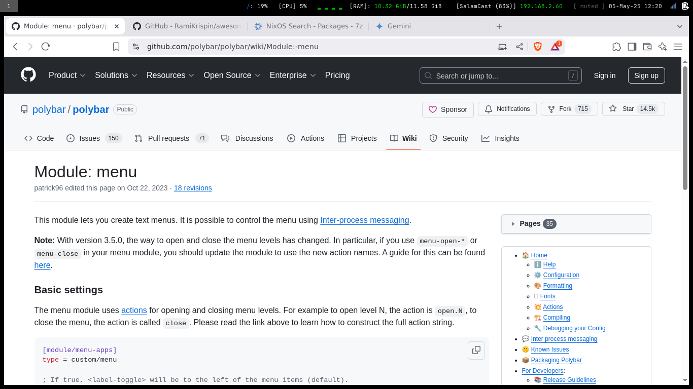
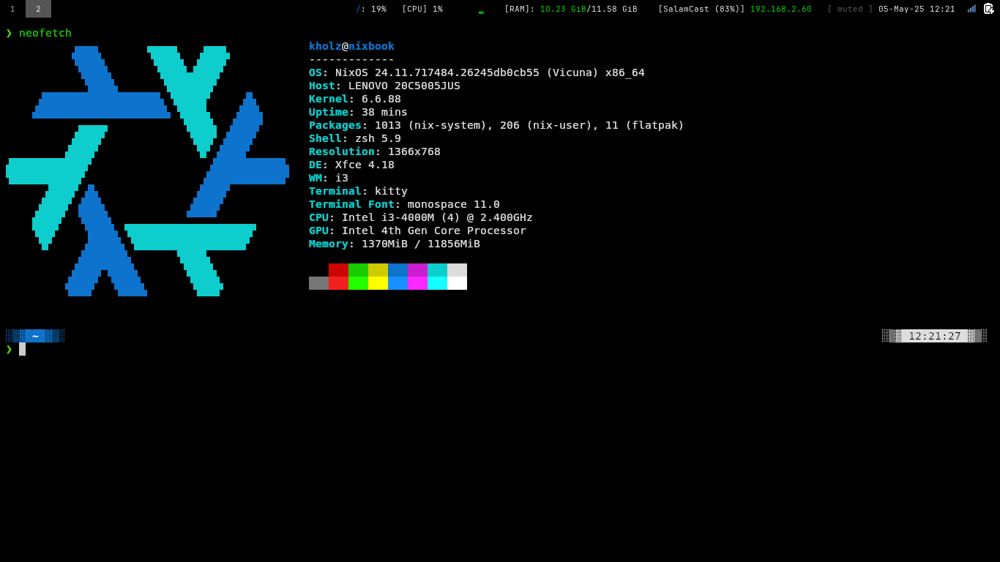
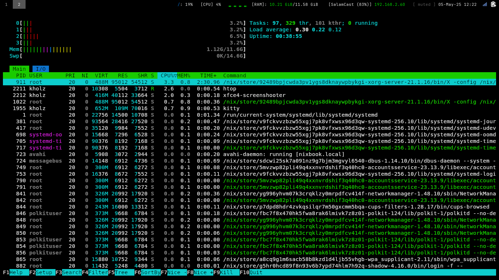

**Convert your old computer (even chromebook) to a user friendly, lightweight, durable, and auto updating operating system build on top of NixOS.**

The goal is to create a "chromebook like" unbreakable computer for a basic dev enviroment

---
Full video walk through of converting from Windows to Nixbook is now live here:

<https://youtu.be/izvVjfqd5j8?si=ZJAdBZRsQO38YIy5>

my project is froked from nixbook by mkellyxp

---

#### My nixbook version with a tiling window manager:
my Base System is a **ThinkPad E440** with i3 2.4 GHz and 12GB ram
- configured i3 desktop and brave browser base
- Zoom, and Libreoffice installed by default
- Flathub enabled out of the box.
- Automatic weekly OS updates with 4 weeks of roll backs
- Daily flatpak updates
- vscode
- docker
- oracle cli
- ghostty
- zsh

**work in progress**

---

#### will work to fix any issues with 


- improve the i3 configuration
- have vscode work well with docker
- a nice looking console for zsh
- need to have a guide for keyboard shortcuts for i3
- map all posible media keys for base NixOS apps in i3
- need to add a E-mail client
- need to add a media player, mplayer or VLC 

---

Step 1 to 3 images thanks to [mkellyxp](https://github.com/mkellyxp/nixbook) creator of nixbook for installing a minimal nixos base system without a desktop and non-free software. I chose to use my swap for hibernate, and it works on my ThinkPad!!

---

## Step 1:  Install NixOS, and choose the No Desktop option.


## Step 2:  Enable unfree software


## Step 3:  Format your drive however you like (erase disk, swap with hibernate)


## Step 4:  Reboot, login, and connect to wifi, then hit ESC

You'll need to setup your network to download the nixbook-tile files

```
nmtui
```


## Step 5:  Go to /etc and nix-shell git

```
cd /etc/
nix-shell -p git 
```


## Step 6:  Clone the nixbook repo  (make sure you run as sudo and you're in /etc!)
```
sudo git clone https://github.com/salamcast/nixbook-tile.git
```

## Step 7:  Run the install script (run this with NO sudo)
you don't need sudo to run the following command.
```
cd /etc/nixbook-tile
./install-clean.sh
```

## Step 8:  Enjoy nixbook!

You can always manually run updates by pressing WinLogo + Shift + Esc, then u to **Update** and r to **Update & Reboot** in the menu.

If you want to completely reset this nixbook, wipe off your personal data to give it to someone else, or start fresh, run **Powerwash** by pressing WinLogo + Shift + Esc, then p.

---

Notes:
- The Nix channel will be updated from this git config once tested, and will auto apply to your machine within a week
- Simply reboot for OS updates to apply.
- Don't modify the .nix files in this repo, as they'll get overwritten on update.  If you want to customize, put your nix changes directly into /etc/nixos/configuration.nix







---

If at any point you're having issues with your nixbook-tile not updating, check the auto-update-config service by running 

```
sudo systemctl status auto-update-config
```

If it shows any errors, go directly to /etc/nixbook-tile and run

```
sudo git pull --rebase
```

Then you can start the autoupdate service again by running

```
sudo systemctl status auto-update-config
```
